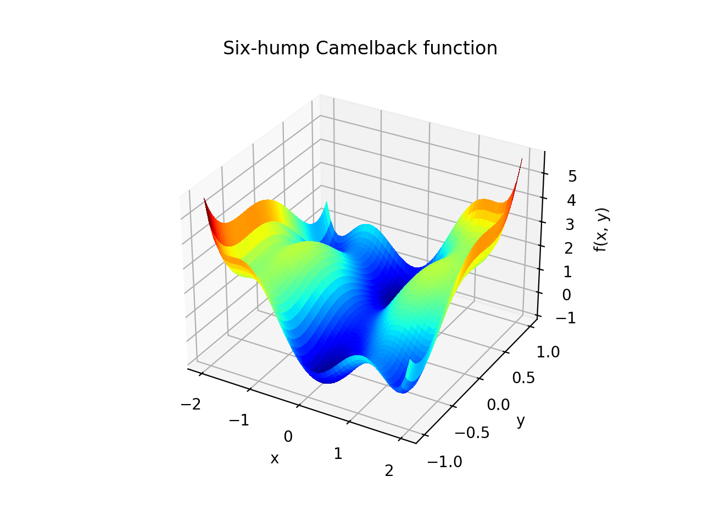
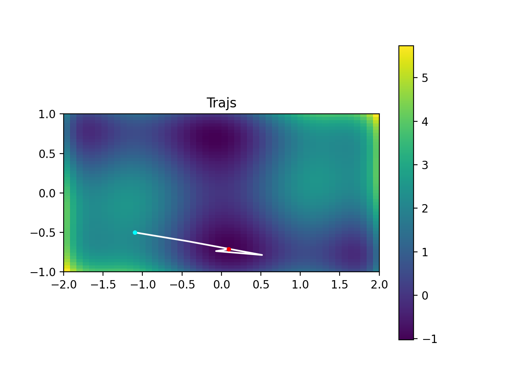

# Tutorial of Armijo backtracking line search for Newton method in Python

[You can read this story on Medium here.](https://medium.com/practical-coding/line-search-methods-in-optimization-dee49c1dec0c)

## Contents

* `newton.py` contains the implementation of the Newton optimizer.
* `main.py` runs the main script and generates the figures in the `figures` directory.
* `plot.py` contains several plot helpers.

## Results

The 6 hump camelback objective function:

A sample trajectory ending at a global minimum:

The line search at one of the optimization steps:

(red shows initial step; green shows after line search).